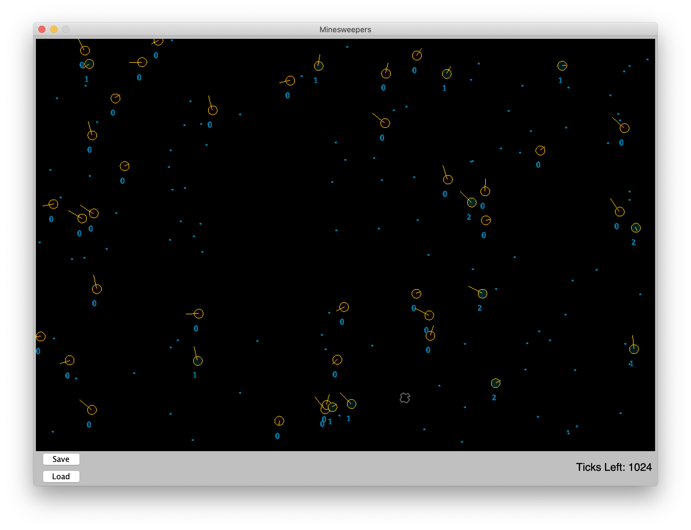
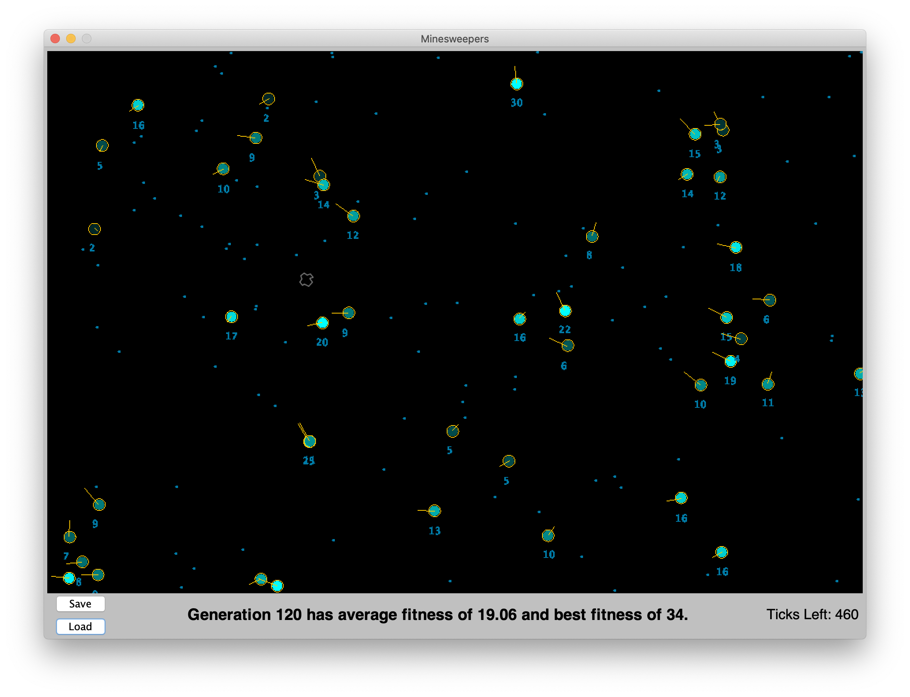

# Minesweepers

<em>Minesweepers</em> is a visual simulation that combines a feedforward neural network with a genetic algorithm to train agents to efficiently pick up blue mines and to avoid bad asteroids. At the start, each agent is given random characteristics, but at the end of each generation, the agent with the best characteristics is chosen to be the foundation of the next generation. This process repeats every 1600 ticks, and eventually leads to very intelligent agents, which can be seen below.

## Examples

### Generation 0 Game State:

### Generation 120 Game State:

## Features

* Customizable and agile feedforward neural network for each agent.
* Genetic algorithm that locates the best-performing agents at the end of each generation and prepares new agents after applying crossover and mutation algorithms.
* Visual representation of the game state for easy interpretation of the progress that the agents have made, which includes an updating status bar below the game window.
* Save button that serializes the current state of the agents, each of their unique neural networks, the location of each mine, and the remaining time left in the generation.
* Load button that deserializes the previously-saved game state.
* Neural network input visualization mode (accessible by pressing the p key)

## Deployment

* Either clone or download the project into your favorite Java IDE (tested in IntelliJ and Eclipse)
* Settings for visualization, the neural networks, the genetic algorithm, the mines, and the agents can be found in the Params class
  * For an optimal simulation, the default settings are sufficient and need not be changed.

## License

This project is licensed under the MIT License - see the [LICENSE.md](LICENSE.md) file for details

## Acknowledgments

* [Travis Ortogero](https://www.georgeschool.org/profile/travis-ortogero/), a mentor of mine at [George School](https://www.georgeschool.org/) who laid out the foundation for this project.